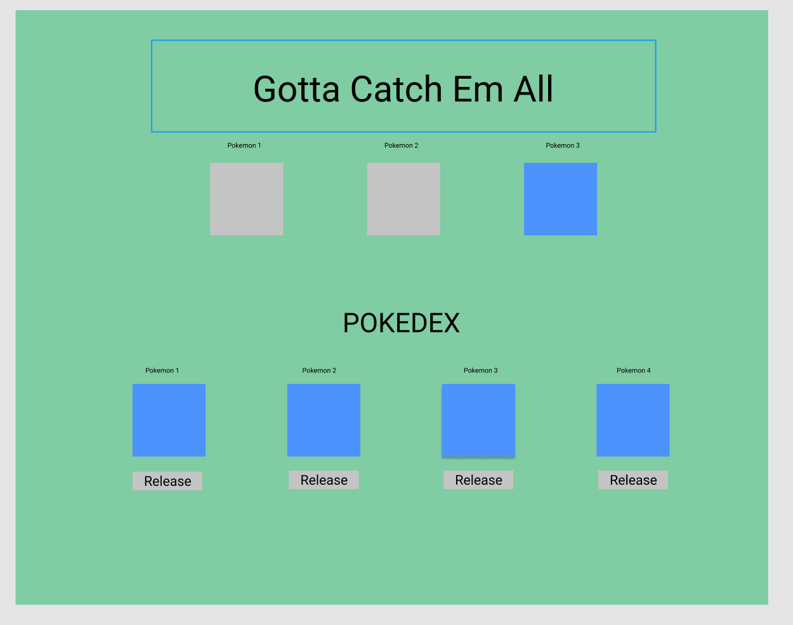
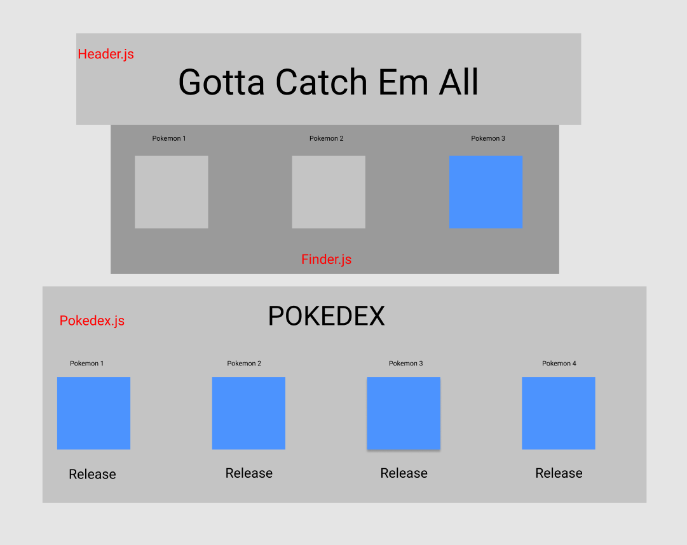
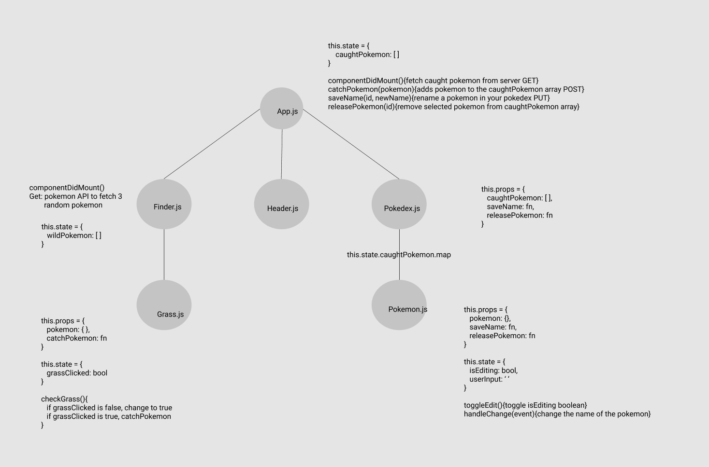

1. create a github repo
2. npx create-react-app 
2. delete contents of README.md
3. Start on below


# Pokemon Catching App

## Application Concept and Wireframe
### Concept and App Specifications
- This is a Pokemon catching app
- We will be utilizing the Pokemon API for the Pokemon data
- Full CRUD
    - Get - Get any Pokemon that we have caught already
        - Get three random Pokemon to choose between from API
    - Post - Catch Pokemon and add them to our Pokedex
    - Put - Give our Pokemon a nickname
    - Delete - Release our Pokemon from our Pokedex

### Functionality
- We want a header with the Pokemon slogan across the top
- When the app loads, we want to see three grass images below the header
- When the grass image is clicked, a random Pokemon appears
- All or one of the grass images can be clicked to display Pokemon
- Once we choose a Pokemon, it will be added to our Pokedex and our Pokemon options will all be reset behind grass
- The Pokedex will display below the grass/Pokemon images
- Once a Pokemon is clicked, it will be added to the bottom of the Pokedex list of Pokemon caught
- When you click on the Pokemon name, an input box appears where can update the name of the Pokemon to give it a nickname
- Each Pokemon will have the option to release it from our caught list


    
### Endpoints
- Get - Get three random pokemon to display from API
    - This request we are going to place in our server / can also be placed in the front-end
    - This request will also trigger every time a Pokemon is caught, so it will be passed down to the Grass component via props
- Get - Get all pokemon that have been caught / in Pokedex
    - This request we are going to put in App.js
    - Put at App.js level so we have access to all of our caught Pokemon across our application
    - Want this to trigger when the component mounts
- Post - Add a new pokemon to our caughtPokemon list
    - Affecting our master caughtPokemon list so it will sit in App.js and be passed down to the Grass component via props
- Put - Change the Pokemon name / give it a nickname
    - Affecting our master caughtPokemon list so it will sit in App.js and be passed down to the Pokemon component via props
- Delete - Release Pokemon from caughtPokemon list
    - Affecting our master caughtPokemon list so it will sit in App.js and be passed down to the Pokemon component via props

<br />
<br />
<br />
<br />
    
### Component Architecture / Tree
- App.js (stateful - this.state.caughtPokemon)
    - Header (functional)
    - Finder (stateful - this.state.wildPokemon)
        - Grass (stateful - this.state.grassClicked)
    - Pokedex (functional)
        - Pokemon (stateful - this.state.editing, this.state.nickname)

### Wireframe
Start drawing


<br />
<br />
When you get to the component Tree follow these steps:

<br />
<br />

1. App.js (stateful)
```
this.state = {
    caughtPokemon: []
}

componentDidMount(){fetch caught Pokemon from server GET}
catchPokemon(pokemon){adds pokemon to the caughtPokemon array POST}
saveName(id, newName){rename a pokemon PUT}
releasePokemon(id){removes a pokemon from the caughtPokemon array DELETE}
```
2. Finder.js (stateful)
```
this.props = {
    catchPokemon: fn
}

this.state = {
    wildPokemon: []
}

componentDidMount(){fetch 3 random pokemon from pokeAPI GET}
```

<br />
<br />

- connect Finder.js to Grass.js with caption ```this.state.wildPokemon.map```. 
- We will render Grass.js using the map method in Finder.js
<br />
<br />

3. Grass.js (stateful)
```
this.props = {
    pokemon: {},
    catchPokemon: fn
}

this.state = {
    grassClicked: bool
}

checkGrass(){
    if grassClicked is false, change to true
    else if grassClicked is true, catchPokemon
}
```
4. Header.js (functional)
5. Pokedex.js (functional)
```
this.props = {
    caughtPokemon: []
    saveName: fn
    releasePokemon: fn
}
```
<br />
<br />

- connect Pokedex.js to Pokemon.js with caption ```this.state.caughtPokemon.map```. 
- We will render Pokemon.js using the map method in Pokedex.js
<br />
<br />
6. Pokemon.js (stateful)

```
this.props = {
    pokemon: {},
    saveName: fn,
    releasePokemon: fn
}

this.state = {
    isEditing: bool,
    userInput: ''
}

toggleEdit() {toggle isEditing boolean}
handleChange(event){change the name of the pokemon}
```

